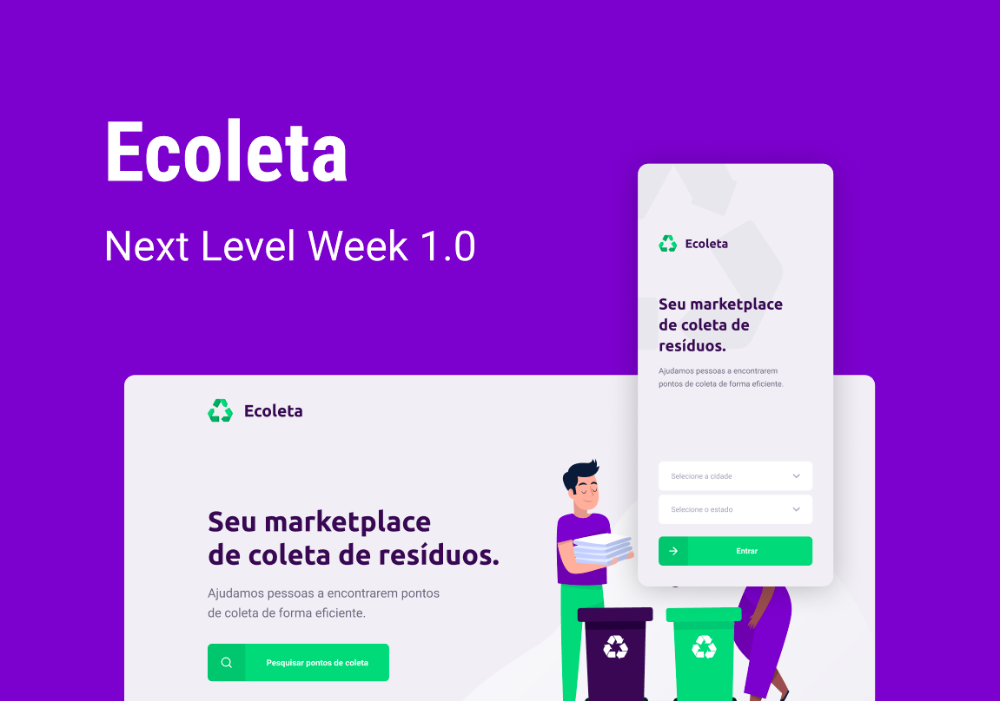

<h1 align="center">
   
</h1>

<h2 align="center">Next Level Week #01</h2>

<p align="center">
  <a href="https://www.linkedin.com/in/lucasmoraes2/">
    
  </a>
</p>

## :deciduous_tree: Sobre o projeto

O Ecoleta :recycle: foi um projeto desenvolvido na primeira edição da semana Next Level Week realizado pela Rocketseat. O objetivo desse projeto foi de construir uma aplicação para facilitar a comunicação e contato entre as pessoas e os pontos de coleta de resíduos.


<p align="center">
  
</p>

## :rocket: Tecnologias

*  [NodeJS][nodejs]
*  [TypeScript][typescript]
*  [ReactJS][reactjs]
*  [React Native][reactnative]
*  [Expo][expo]
*  [SQLite3][sqlite]

## :information_source: Como instalar

### Instalação da API

```bash
# Terminal 1

# Clone esse repositório
$ git clone https://github.com/lucasmoraes2/next-level-week-01

# Entre no diretório server
$ cd server/

# Instale as depências do projeto
$ npm install

# Rode migrates
$ npm run knex:migrate

# Rode seeds
$ npm run knex:seed

# Inicie a API
$ npm run dev

# Rodando na porta 3333
```

### Instalação da aplicação web

```bash
# Terminal 2

# Clone esse repositório
$ git clone https://github.com/lucasmoraes2/next-level-week-01

# Entre no diretório web
$ cd web/

# Instale as depências do projeto
$ npm install

# Inicie a aplicação web
$ npm start

# Rodando na porta 3000
```

### Instalação da aplicação mobile

```bash
# Terminal 3

# Clone esse repositório
$ git clone https://github.com/lucasmoraes2/next-level-week-01

# Entre no diretório web
$ cd mobile/

# Instale as depências do projeto
$ npm install

# Inicie a aplicação mobile
$ npm start

# Rodando na porta 19002
```

 [LinkedIn](https://www.linkedin.com/in/lucasmoraes2/)

By Lucas Moraes :heart:

[nodejs]: https://nodejs.org/
[typescript]: https://www.typescriptlang.org/
[reactjs]: https://reactjs.org/
[reactnative]: https://reactnative.dev/
[expo]: https://expo.io/
[sqlite]: https://www.sqlite.org/
